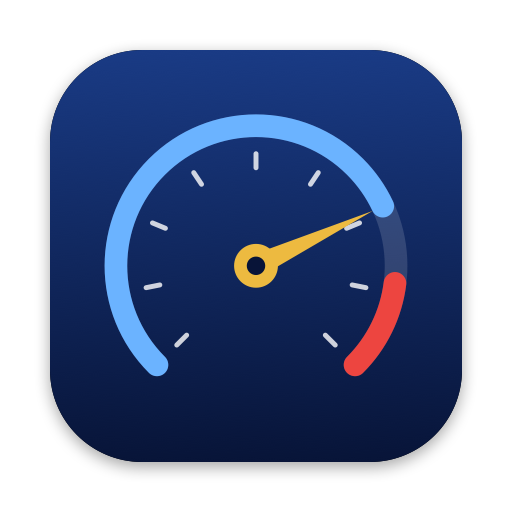
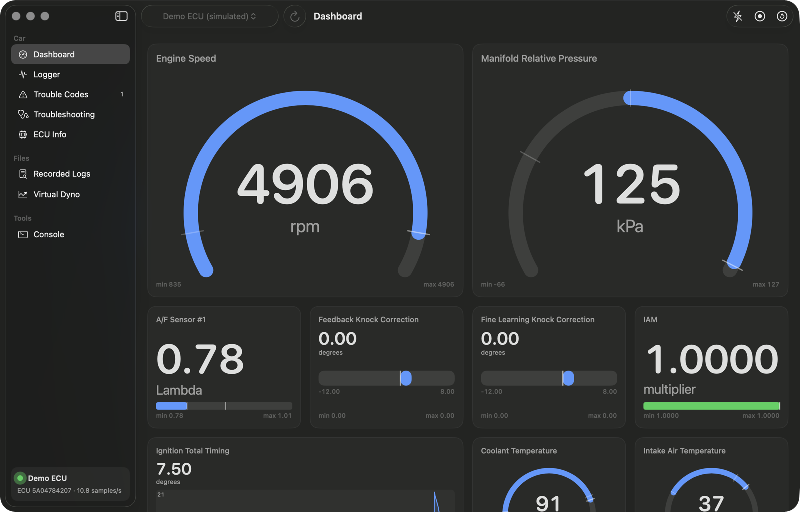
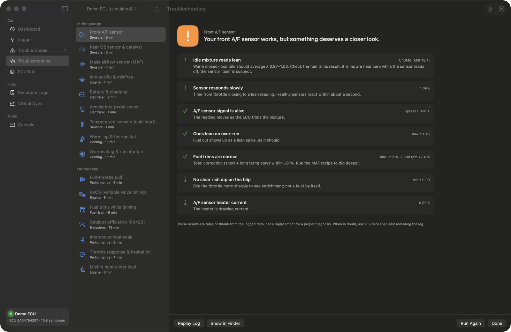
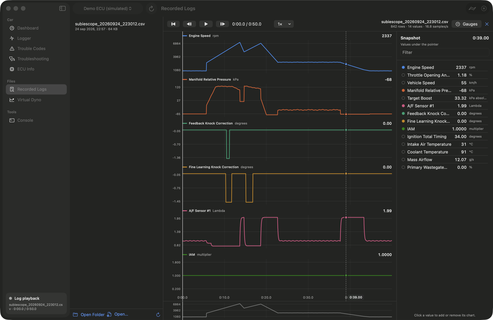
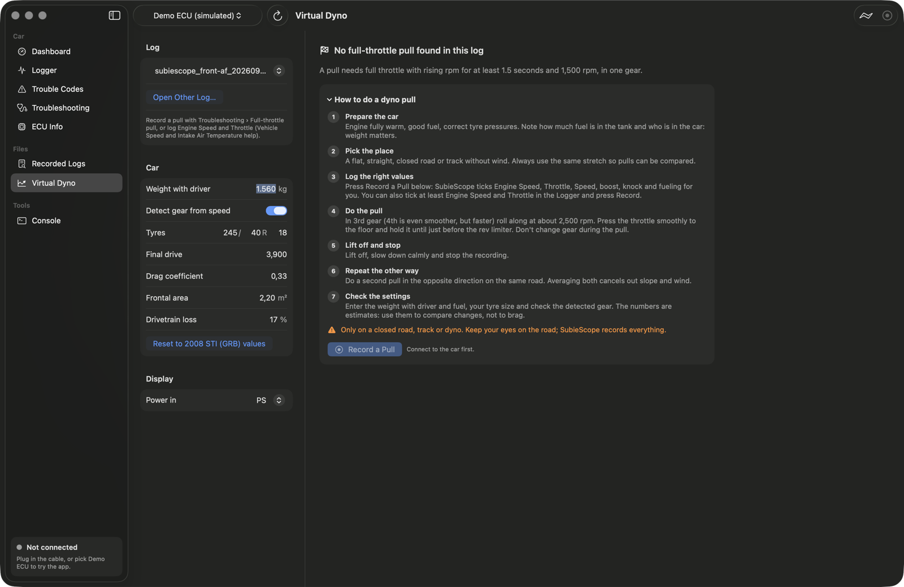
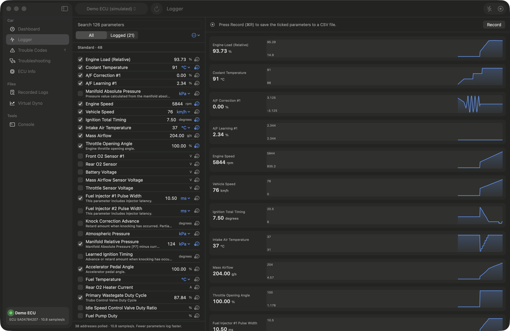

<p align="center">
  
</p>

<h1 align="center">SubieScope</h1>

<p align="center">
  Live data, logging, diagnostics and a virtual dyno for your Subaru, on your Mac.<br>
  Plug in a cheap VAG KKL cable, or a Bluetooth OBD-II adapter for newer cars, and see what your car sees.
</p>

<p align="center">
  <a href="https://github.com/marvin-socialista/subiescope/releases/latest"><b>Download for macOS</b></a> ·
  <a href="#supported-cars">Supported cars</a> ·
  <a href="#support">Buy me a coffee</a>
</p>



SubieScope talks to the engine ECU over Subaru's SSM protocol, the same one the dealer tool uses, or over standard OBD-II with a Bluetooth adapter for newer cars. It stands on the shoulders of two great open-source projects: [FreeSSM](https://github.com/Comer352L/FreeSSM) (diagnostics) and [RomRaider](https://github.com/RomRaider/RomRaider) (logging and its huge parameter database). SubieScope brings both to the Mac as one native app.

> Not affiliated with or endorsed by Subaru Corporation. Use at your own risk; see [Safety](#safety).

## What it does

- **Dashboard**: live gauges as dials, big digital numbers, bars or trend graphs. Drag to reorder, pick a size per gauge, and see min/max markers. Knock correction turns orange or red and IAM turns green when it's at 1.0.
- **Logger**: choose from hundreds of parameters, including the ECU-specific "extended" ones (IAM, feedback and fine-learning knock correction, target boost and more), and record to CSV in RomRaider's format. Datazap, DataLog Lab and Virtual Dyno open these files too.
- **Troubleshooting**: 17 guided tests that tell you what to do, coach you live ("a bit more throttle", "hold 2,500 rpm") and explain the result in plain language:
  - *In the garage*: front A/F sensor, rear O2 sensor & catalyst, MAF sensor, idle quality & misfires, battery & charging, accelerator pedal sensor, temperature sensors, warm-up & thermostat, overheating & radiator fan
  - *On the road*: knock check (how much knock, where and why), full-throttle pull (knock, boost, fueling), AVCS, fuel trims while driving, catalyst efficiency (P0420), intercooler heat soak, throttle response, misfire hunt
- **Wideband gauge** (experimental): have an AEM wideband in the car? SubieScope reads it at the same time, so its air/fuel reading is on the dashboard and in the same log as rpm, boost and knock. See [below](#aem-wideband-gauge-experimental).
- **Trouble codes**: read current and stored codes with an explanation, possible causes and fixes for each code, copy them or save them as a PDF or text file, and clear the ECU memory.
- **Log playback**: replay any log on the gauges, scrub through it and hover the charts to see every value at that moment. It also opens RomRaider logs, including ones written by Dutch or German Windows installs.
- **Virtual dyno**: turns a full-throttle pull into wheel horsepower and torque curves, tells you whether the pull was good or should be redone, and compares pulls. Pick your car from a list of 93 Subarus and its weight, gearing and tyre size are filled in.
- **ROM editor** (Advanced mode): open a ROM file you already have, or read the ROM from the car (experimental), see its maps by name, edit them, correct the Subaru checksums and save to a new file. Editing happens in a file on your Mac, and SubieScope never writes to the car. It is off by default and lives behind Advanced mode (Settings), which you turn on after accepting a warning. See [below](#rom-editor-advanced-mode).
- **Cable setup**: finds your cable, tells you whether it needs a driver, and tests the connection step by step.

<table>
  <tr>
    <td></td>
    <td></td>
  </tr>
  <tr>
    <td></td>
    <td></td>
  </tr>
</table>

## Two ways to connect

SubieScope has two connection types. The first-run wizard asks what car you have and recommends one, and you can switch any time in the sidebar or the Car menu.

| | **Subaru SSM** (USB cable) | **OBD-II** (Bluetooth adapter, new) |
|---|---|---|
| Best for | Subarus up to about 2014 | Newer Subarus (about 2015 and up) and any other car since 2008 |
| You need | A VAG KKL 409.1 USB cable with an FTDI chip, about €10 to 15 | An ELM327 adapter with Bluetooth 4.0 (BLE), such as the Vgate iCar Pro |
| Data | Everything the ECU knows: knock, IAM, boost target, AVCS and hundreds more | The standard values: rpm, speed, temperatures, load, fuel trims, timing, boost, battery voltage, wideband A/F where available |
| Trouble codes | Subaru codes, clear ECU memory | Confirmed and pending codes, clear codes, VIN |
| Speed | Roughly 10 to 25 samples per second | Roughly 3 to 10 samples per second, depending on the adapter |
| Troubleshooting tests and dyno | All of them | The tests that only need standard values |

OBD-II mode is new and has been tested against a simulated adapter and car. Reports from real cars and adapters are very welcome.

## What you need

- A Mac with **macOS 14 Sonoma or newer** (Apple silicon or Intel).
- For **Subaru SSM**: a **VAG KKL 409.1 USB cable with an FTDI FT232RL chip**, about €10–15 online. macOS already has the FTDI driver, so there's nothing to install.
  - Avoid cables with a CH340 chip: they're known to be unreliable with Subarus.
  - Cables with a switch: use the position that puts K-line on pin 7.
  - Already have a **Tactrix OpenPort 2.0**? It can be used instead of the KKL cable, as an experiment: see [below](#tactrix-openport-20-experimental).
  - A Subaru that speaks SSM over K-line (see below).
- For **OBD-II**: an ELM327 adapter with **Bluetooth 4.0 (BLE)**, such as the Vgate iCar Pro BLE 4.0. The first time, macOS asks whether SubieScope may use Bluetooth.
  - **USB and Wi-Fi ELM327 adapters** are experimental, see [below](#usb-and-wi-fi-adapters-experimental). Bluetooth Classic adapters are not supported.
- Optional, to log an **AEM wideband gauge** too: a USB to RS-232 serial adapter for the gauge, see [below](#aem-wideband-gauge-experimental).

## Supported cars

In **Subaru SSM** mode, SubieScope works with Subarus whose engine ECU speaks **SSM2 over K-line** (OBD pin 7). That covers most petrol Subarus from **1999 to about 2014**. Newer cars talk to the diagnostic port over **CAN only**, which a KKL cable can't do: use **OBD-II** mode for those.

| Model | Years | Status |
|---|---|---|
| Impreza, WRX, WRX STI (GC/GF, GD/GG, GE/GH/GR/GV) | 1999 to 2014 | Supported |
| Legacy, Liberty, Outback (BE/BH, BL/BP) | 1999 to 2009 | Supported |
| Legacy, Liberty, Outback (BM/BR) | 2010 to 2014 | Most models; some later ECUs are CAN-only |
| Forester (SF, SG, SH) | 1999 to 2013 | Supported (SH: most models) |
| Baja | 2003 to 2006 | Supported |
| Tribeca (B9 Tribeca) | 2006 to 2014 | Supported |
| WRX / STI (VA), Forester (SJ and newer), Levorg, XV/Crosstrek, BRZ | 2014 and newer | **Not with the cable** (CAN only, BRZ: Toyota ECU). Use OBD-II mode with a Bluetooth adapter |

What your car supports depends on its ECU:

- **Standard parameters, trouble codes and troubleshooting tests** work on every supported ECU. The ECU reports which values it has, and SubieScope only shows those.
- **Extended parameters** (IAM, fine and feedback knock correction, target boost and so on) are ECU-specific. They're available when your ECU ID is in RomRaider's definitions, which covers over 600 ECU IDs.

**Tested on:** SubieScope was developed against a simulated 2008 JDM WRX STI (GRB, EJ207, ECU ID `5A04784207`). Real-car testing is ongoing, and reports of which cars work are very welcome: please open an [issue](https://github.com/marvin-socialista/subiescope/issues) with your model, year, market and the ECU ID shown on the ECU Info page.

## Install

1. Download `SubieScope.dmg` from the [latest release](https://github.com/marvin-socialista/subiescope/releases/latest).
2. Open it and drag **SubieScope** to **Applications**. The app is signed and notarized by Apple, so it opens without warnings.
3. On first launch a short **setup wizard** asks what car you have, recommends the right connection, walks you through connecting and testing it, and can start a demo car if you have no hardware yet. (In SSM mode SubieScope also downloads RomRaider's parameter definitions once, about 2 MB.)

**Updates:** once a day when it opens, SubieScope asks GitHub for the newest version and shows what's new when there is one. Nothing about you or your car is sent. You can turn this off in Settings, or look yourself with **SubieScope > Check for Updates**.

## First drive

1. Plug the cable (or Bluetooth adapter) into the OBD port under the dashboard (driver's side). For the cable, also plug it into your Mac.
2. Turn the ignition **ON**. The engine may be off or running.
3. In the wizard (or the sidebar) press **Test Connection**, then **Connect**.
4. The dashboard comes alive. Press **⌘R** to record a log and **⌘R** again to stop.

No hardware yet? Pick the demo car in the cable or adapter menu to explore everything with a simulated car. In **Troubleshooting** you can even make the demo car develop faults (a dirty MAF, a vacuum leak, a dying catalyst…) to see how the tests catch them.

## Command line

The app bundle also contains `subiescope-cli`, which is handy at the car or for bug reports:

```sh
/Applications/SubieScope.app/Contents/MacOS/subiescope-cli ports     # list cables
/Applications/SubieScope.app/Contents/MacOS/subiescope-cli probe     # connect and show the raw traffic
/Applications/SubieScope.app/Contents/MacOS/subiescope-cli log --csv pull.csv --seconds 30
/Applications/SubieScope.app/Contents/MacOS/subiescope-cli codes     # read trouble codes
/Applications/SubieScope.app/Contents/MacOS/subiescope-cli rom tune.bin        # inspect a ROM file
/Applications/SubieScope.app/Contents/MacOS/subiescope-cli rom fix tune.bin    # correct its checksums (file only)
```

Add `--demo` to any command to use the simulated car. `subiescope-cli demo --obd` runs a simulated OBD-II adapter as a USB port and as a Wi-Fi address on your own Mac, for trying the app's USB and Wi-Fi connections without the hardware. It also runs a simulated AEM wideband gauge on a port of its own.

### Talking to the running app (developer)

With **Settings > General > Let the command line tool control the app** on (or start the app with `-remoteControl YES`), `subiescope-cli remote` sends read-only requests to the adapter the app is connected to. That makes it possible to try things, or let an AI assistant try things, against a real car without rebuilding anything:

```sh
subiescope-cli remote adapters            # Bluetooth adapters in range, USB ports, the Wi-Fi address
subiescope-cli remote connect             # connect the selected adapter
subiescope-cli remote send 010C           # any raw request, here engine speed
subiescope-cli remote send ATSH7A2        # AT commands work too (set the request header)
subiescope-cli remote scan22 7E0 7E8 10A0 10FF   # which Mode 22 values does the ECU answer?
subiescope-cli remote values              # the live values
subiescope-cli remote release             # reset the adapter and resume live polling
```

It is off by default and listens on a socket only your own user can open. Only read-only services are allowed (current data, trouble codes, vehicle info, read-data-by-identifier). Clearing codes, writing to the car, security access, routines, ECU reset and reprogramming are refused, and so are the adapter commands that change it permanently. Every command goes in the log.

## Extended values (experimental)

Some newer Subarus can report more than standard OBD-II, such as AVCS (VVT) angles, knock and boost control, through OBD-II "Mode 22". In OBD-II mode, turn on **Settings > General > Extended values** (or use the switch on the ECU Info page). After connecting, SubieScope checks which of about 130 known values your car answers and offers only those in the Logger. When the car reports it, the ECU Info page also shows the ECU ID, which says exactly which software the engine computer runs.

**It might work on your car, but it is untested.** It is meant for the Subarus from about 2015 that the KKL cable cannot reach, including cars with the FA20 or FA24 engine such as the 2015 and newer WRX. So far it has only been tested against a simulated car, not on a real one. The definitions are community data, mostly from the Impreza, Forester, Outback and Crosstrek, so check a value against what you expect before you trust it. Older cars do not answer at all: a 2008 WRX STI tested at the car answered none, which matches the community data.

**If you try it, a report helps a lot.** **Help > Send Diagnostic Report…** shows which values your car answered, and which values it says it has that SubieScope has no name for yet. That is how these cars get better support.

You can also choose to show pressures in **kPa, bar or psi** (Settings > General > Pressure).

## USB and Wi-Fi adapters (experimental)

Besides Bluetooth 4.0, OBD-II mode can use an ELM327 adapter with a **USB cable** or with **Wi-Fi**. Pick it in the adapter menu, under "USB and Wi-Fi (experimental)", or in the connection panel.

- **USB:** plug the adapter into your Mac and the car, pick its port and press Connect. SubieScope tries the speeds these adapters use (38400, 115200, 9600 and a few more), which takes a few seconds. The adapter's USB chip needs a driver in macOS: FTDI chips work out of the box.
- **Wi-Fi:** join the adapter's own Wi-Fi network on your Mac first (often named WiFi_OBDII or V-LINK; your Mac has no internet while it is on that network), then press Connect. Nearly all adapters use the address `192.168.0.10:35000`, which is filled in for you. Change it in the connection panel if yours differs. macOS may ask whether SubieScope may find devices on your local network: say yes.

Both are new and have been tested against a simulated adapter only, not against real hardware. If yours does not work, **Help > Send Diagnostic Report…** shows what the adapter answered, and reports that it does work are just as welcome. A VAG KKL cable is not an ELM327 adapter: it only works in Subaru SSM mode.

## AEM wideband gauge (experimental)

Have an AEM wideband air/fuel gauge in the car? SubieScope can read it at the same time as the car, so its reading sits on the Dashboard, in the Logger and in the same rows of your CSV log as rpm, boost and knock. It works with the SSM cable and with OBD-II. RomRaider has the same idea and calls it an external sensor.

- **Which gauges:** the X-Series UEGO gauge (30-0300) and the older UEGO gauges (30-4100, 30-4110), through their serial output. The gauge sends what its display shows, so set it to AFR or lambda: either works. AEM controllers that send lambda at 19200 baud are recognised too. Other brands are not supported yet.
- **What you need:** a **USB to RS-232 serial adapter** for the gauge alone. The cable or adapter that goes to the car can't be shared. An adapter with an FTDI chip needs no driver.
- **Wiring:** the gauge's **blue** wire is its serial output. Connect it to pin 2 (receive) of the adapter's 9-pin plug, and pin 5 (ground) to the gauge's ground.
- **In the app:** turn on **Settings > Wideband > Log an AEM wideband gauge** and pick the adapter's port. SubieScope starts listening when you connect to the car. "AEM Wideband A/F" appears at the top of the Logger, already ticked; add it to the Dashboard with the gauge button, and choose AFR or lambda like for any other value.

**In the troubleshooting tests:** with the gauge turned on, the tests that look at the mixture get a switch, "Read the mixture from the wideband gauge". The full-throttle pull, the knock check and the others then judge the mixture your AEM gauge measures instead of the car's own front A/F sensor, and the result says so. The Front A/F sensor test is the exception: it is about the car's own sensor, so there the gauge is a second opinion next to it, and the result tells you whether the two agree. "Analyze a Log…" follows the same switch for logs that have the gauge in them.

The gauge sends about ten readings per second, and the newest one is added to every sample from the car. If the gauge stops sending (ignition off, a loose wire), the log shows a gap instead of a number that no longer moves. The connection panel and Settings > Wideband tell you whether readings are coming in.

This is new and has been tested against a simulated gauge only, not against a real one. The demo car has a simulated gauge in its exhaust, so you can see how it works without any hardware: turn the option on and connect to the demo car. If yours does not work, **Help > Send Diagnostic Report…** shows what the gauge sent, and reports that it does work are just as welcome.

## Tactrix OpenPort 2.0 (experimental)

Have a Tactrix OpenPort 2.0 from tuning your car? In Subaru SSM mode it can take the place of the KKL cable: the dashboard, the logger, trouble codes, the troubleshooting tests and the dyno all work the same.

- **No driver needed.** Tactrix only makes a driver for Windows, but on a Mac the cable shows up as a plain USB serial port, and SubieScope talks to it directly.
- **Take the microSD card out of the cable first.** With a card in, it shows up as a USB disk and not as a cable.
- **In the app:** turn on **Settings > General > Tactrix OpenPort 2.0 cable** (or press "Turn On OpenPort Support" in the connection panel when it is plugged in), then press Connect. **Car > Cable Setup** tests it step by step. The OpenPort measures the car's battery, so SubieScope can tell a cable that is not in the car from an ignition that is off.
- **Which cars:** the same ones as with the KKL cable, see [Supported cars](#supported-cars). The newer, CAN-only cars still need OBD-II mode.

This is new and has **not been tested with a real OpenPort yet**: only against a simulated cable, built from how other open-source projects describe it. It may well not work on yours. If it does not, **Help > Send Diagnostic Report…** shows what the cable answered, and `subiescope-cli probe` prints the whole conversation. Reports that it does work are just as welcome. If logging stalls, turn off Settings > General > Fast poll.

## ROM editor (Advanced mode)

The ROM editor is off by default. Turn on **Settings > Advanced mode** (you have to accept a warning first) and the ROM Editor appears in the sidebar. It works on a **ROM file on your Mac**: one you already have (for example read with FastECU or EcuFlash), or one SubieScope reads from the car. It opens the file, identifies it, shows its maps by name, lets you edit them (or raw bytes), corrects the Subaru Denso checksums, and saves to a new file.

> **ROM editing is for advanced users and entirely at your own risk.** The numbers in a ROM decide how much fuel and boost the engine runs and when it ignites. A wrong change can make the engine knock, run lean or be damaged, and that is not covered by any warranty. Tuning may also be against the law for a car used on public roads where you live. Only change values you understand, always keep the original file, and treat every number as yours to answer for.

- **It never writes to the car.** Editing and saving only change a file on your Mac. SubieScope cannot flash a ROM back to the car: to put an edited one on, you still need another tool (such as FastECU or EcuFlash) and the right hardware.
- **Read the ROM from the car (experimental)**: the "Read from car" card copies the ROM out of the engine ECU and loads it into the editor. It is for the 2008 and later Subarus with a Denso SH7058 ECU on the CAN bus, such as the 2008+ STI. You need an OBDLink or other STN-based adapter in OBD-II mode (a plain ELM327 cannot do it), or a [Tactrix OpenPort 2.0](#tactrix-openport-20-experimental). A KKL cable cannot do it. Ignition on, engine off, a healthy battery, and leave the car alone until it finishes: it takes several minutes. SubieScope loads a small helper program into the ECU's memory, which copies the ROM out. It only reads: it never erases or writes the ECU's program, and the helper program is gone once you turn the ignition off and on again. This has **not been tested on a real car yet**, only against a simulated ECU, so it may not work on yours and you use it at your own risk. If it fails, **Help > Send Diagnostic Report…** shows where it stopped.
- **Maps by name**: SubieScope downloads RomRaider's `ecu_defs.xml` (from the project's own [definitions](definitions/) folder, credited to RomRaider), matches your ROM by its internal ID, and shows its maps (fuel, timing, boost and the rest) as tables with their axes and real-world units. Edit a cell and the value is scaled back and written. A definition is applied automatically only on an exact internal-ID match; otherwise it suggests the closest ones for you to confirm, and you can always point it at your own `ecu_defs.xml`. Raw byte editing is there too, for anything a definition does not cover.
- **Checksums**: after you edit a map the ROM's checksums no longer add up, and an ECU rejects a ROM whose checksums are wrong. The editor recomputes them for the petrol Denso SH7055 and SH7058 families (this covers the 2008+ STI). Diesel and Hitachi ROMs are not handled yet.

The checksum maths, the ROM layout facts and the steps for reading a ROM from the car are a port of [FastECU](https://github.com/miikasyvanen/FastECU) (GPLv3); the map definition format is RomRaider's. SubieScope reads the definitions and does the scaling itself; the whole path (match a ROM, resolve the definition's base inheritance, read a scaled table, write a value back) is covered by tests.

## When something goes wrong

SubieScope keeps a log of what it does in `~/Library/Logs/SubieScope/`. It leaves out your name (your home folder shows as `~`) and anything shaped like a VIN, and it never leaves your Mac by itself. If the app crashes, it says so the next time it starts, and starts without connecting automatically. **Help > Send Diagnostic Report…** bundles the log, your Mac model and any macOS crash reports into one file you can email to the developer or attach to an [issue](https://github.com/marvin-socialista/subiescope/issues). **Help > Save Diagnostic Report…** saves it instead.

The OBD-II mode is built to keep going when a car or adapter is quirky: values a car does not answer are skipped, an adapter that can't read several values at once is read one at a time, and a car that won't list its supported values is probed directly.

## Safety

- Do full-throttle pulls and driving tests **only on a closed road, a track or a dyno**. Let a passenger watch the screen.
- The troubleshooting results are rules of thumb from logged data, **not a replacement for a proper diagnosis**. When in doubt, ask a Subaru specialist and bring the log.
- **Clear memory** erases stored trouble codes and resets what the ECU has learned (fuel trims, IAM). The car relearns within a few drives.
- SubieScope only reads the ECU, apart from clearing memory. It never flashes or changes the ECU's program. The ROM editor edits a file on your Mac, never the car. Reading a ROM from the car (Advanced mode, experimental) loads a small helper program into the ECU's memory to copy the ROM out; that program is gone after you turn the ignition off and on again.

## Build from source

You need Xcode 16 or newer (Swift 6).

```sh
git clone https://github.com/marvin-socialista/subiescope.git
cd subiescope
scripts/fetch-definitions.sh   # RomRaider logger definitions, for development builds
swift test                     # protocol, parser, troubleshooting and dyno tests
scripts/build-app.sh           # builds build/SubieScope.app and build/subiescope-cli
open build/SubieScope.app
```

How the code is organised:

| Path | What's there |
|---|---|
| `Sources/SSMKit` | The engine, with no UI: serial port, SSM2 protocol, the Tactrix OpenPort, RomRaider definitions parser, polling and fast-poll session, CSV logs, the wideband gauge reader, troubleshooting tests, virtual dyno, and the simulated ECU |
| `Sources/SubieScope` | The SwiftUI app |
| `Sources/SubieScopeCLI` | `subiescope-cli` |
| `Tests/SSMKitTests` | Tests, including an end-to-end run over a pseudo-terminal and every troubleshooting test against simulated faults |

RomRaider's definitions file has no explicit license, so it isn't in this repository. The app downloads it on first launch, and `scripts/fetch-definitions.sh` fetches it for development builds. Both check it against a checksum.

## Credits

- [FreeSSM](https://github.com/Comer352L/FreeSSM) by Comer352L: SSM2 diagnostics, clear-memory procedure, trouble code layout and engine details.
- [RomRaider](https://github.com/RomRaider/RomRaider) and its community: the SSM logger protocol, fast polling, the logger definitions with extended parameters for hundreds of ECUs, and the serial formats of the AEM wideband gauges.
- [SubaruDefs](https://github.com/Merp/SubaruDefs), the Subaru definitions the RomRaider community keeps, collected by Merp: which car, calibration, processor and flash method belong to an ECU ID (over 300 of them, shown on the ECU Info page), and the weights, gearing and tyre sizes in the virtual dyno's list of cars. Only those facts are taken over, in `Sources/SSMKit/Resources/Cars`; `scripts/build-car-data.py` rebuilds them.
- [OBDb](https://github.com/OBDb) (Subaru signal sets for Impreza, WRX, Forester, Outback and Crosstrek): the Mode 22 extended value definitions. That data is licensed [CC BY-SA 4.0](https://creativecommons.org/licenses/by-sa/4.0/); the bundled file `Sources/SSMKit/Resources/ExtendedPIDs/subaru_mode22.json` keeps that license and is generated by `scripts/generate-extended-pids.py`.
- Subaru Diesel Crew ([ParsePID](https://github.com/giotec/ParsePID), GPLv3): how Subaru ECUs list the Mode 22 values they support, and where they report their ROM ID.
- [FastECU](https://github.com/miikasyvanen/FastECU) by Miika Syvänen (GPLv3): the ROM editor's Subaru Denso checksum maths, where Subaru keeps its calibration ID and checksum tables, and the steps for reading a ROM from a Denso SH7058 ECU over CAN. Also how a Tactrix OpenPort is set up for a Subaru's K-line and CAN bus.
- nisprog and npkern by [fenugrec](https://github.com/fenugrec), and the Subaru version by [rimwall](https://github.com/rimwall) (GPLv3): the helper program that copies the ROM out of the ECU. The bundled file `Sources/SSMKit/Resources/Kernels/ssmk_can_tp_sh7058.bin` is the one that ships with FastECU, unchanged.
- [openport-j2534](https://github.com/bisak/openport-j2534) by Biser Atanasov (GPL-3.0-or-later): how a computer talks to a Tactrix OpenPort 2.0, measured on a real cable. SubieScope's OpenPort support is written from those notes.

## Support

SubieScope is free and open source, made by one person in spare time. If it saves you a trip to the dealer, you can [buy me a coffee ☕](https://buymeacoffee.com/socialista). Bug reports and car compatibility reports are just as welcome: [open an issue](https://github.com/marvin-socialista/subiescope/issues).

## License

[GPL-3.0](LICENSE). Subaru, Impreza, WRX, STI, Legacy, Outback, Forester, Baja and Tribeca are trademarks of Subaru Corporation.
